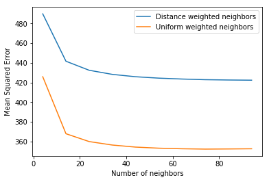
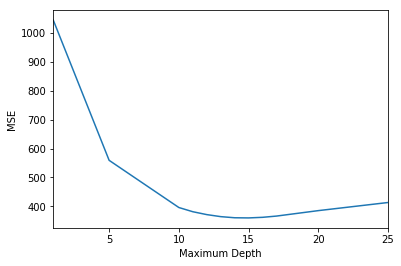
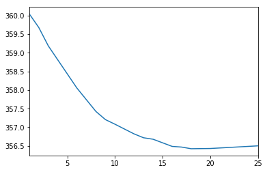
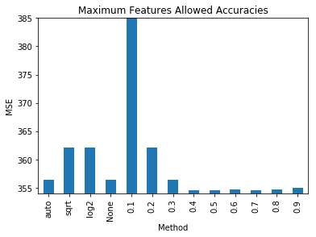
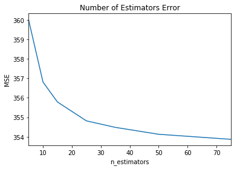

# Salary Predictions Based on Job Descriptions

# Step 3: Develop


```python
import pandas as pd
import matplotlib.pyplot as plt
import numpy as np

%matplotlib inline
```


```python
import sys
sys.path.insert(0, './scripts')

from helpers import load_data, mean_squared_error
from Preprocessing import Preprocessing
```

## Engineering features
* Ensure data is ready for modeling (make Preprocessing.py)
* Create any new features to enhance the model

I wrote Preprocessing.py to do any transformations on the data to get it ready for the models.


```python
path = './model_validation_data/'
files = ['train.csv', 'test.csv']

train_data = load_data(path, files[0], verbose=True)
```

    ----------------------------------train shape-----------------------------------
                                      (694059, 7)                                   
    ------------------------------train's column types------------------------------
    salary                  int64
    jobType                object
    degree                 object
    major                  object
    industry               object
    yearsExperience         int64
    milesFromMetropolis     int64
    dtype: object
    -----------------------------train first five rows------------------------------
                      salary         jobType       degree      major industry  \
    jobId                                                                       
    JOB1362685151623     121  VICE_PRESIDENT    BACHELORS    BIOLOGY      OIL   
    JOB1362684547558      99             CTO  HIGH_SCHOOL       NONE   HEALTH   
    JOB1362684683175     110         MANAGER  HIGH_SCHOOL       NONE     AUTO   
    JOB1362684716169     141          JUNIOR     DOCTORAL       NONE      OIL   
    JOB1362685170911      77         MANAGER    BACHELORS  CHEMISTRY  SERVICE   
    
                      yearsExperience  milesFromMetropolis  
    jobId                                                   
    JOB1362685151623               14                   88  
    JOB1362684547558                6                   79  
    JOB1362684683175                6                   12  
    JOB1362684716169               20                   49  
    JOB1362685170911               17                   76  


```python
target = 'salary'
features = [x for x in train_data.columns if x != target]

train_features = train_data[features].copy()
train_salary = train_data[target].copy()
del train_data
```

I need to separate out the training and tuning data before any preprocessing occurs so I ensure the models are only learning from the training data.


```python
from sklearn.model_selection import train_test_split
features_train, features_tune, salary_train, salary_tune = train_test_split(train_features, train_salary, random_state=44)
```

## Creating Models
* Creating and tuning models ([Linear Regression](#Creating-Models:-Linear-Regression), 
[K-Nearest Neighbors](#Creating-Models:-K-Nearest-Neighbors),
[Random Forest Regressor](#Creating-Models:-Random-Forest))

### Creating Models: Linear Regression

I'm going to start assessing my models with a simple __Linear Regression__ model. This is the basic regression model used by many companies through Excel. There are more complex models utilizing both Linear Regression and penalties, and I will be looking at those after I've tested the Linear Regression model with and without feature engineering.


```python
cols_to_filter = ['companyId']
ordinal_cols = {'jobType': ['JANITOR', 'JUNIOR', 'SENIOR', 'MANAGER', 'VICE_PRESIDENT', 'CFO', 'CTO', 'CEO'],
                'degree': ['NONE', 'HIGH_SCHOOL', 'BACHELORS', 'MASTERS', 'DOCTORAL']
               }

p_simple = Preprocessing(cols_to_filter=cols_to_filter, ordinal_cols=ordinal_cols)

#t_ denotes that the data has been transformed
t_features_train = p_simple.fit_transform(features_train)
t_features_tune = p_simple.transform(features_tune)

t_features_train.head()
```


<div>
<style scoped>
    .dataframe tbody tr th:only-of-type {
        vertical-align: middle;
    }

    .dataframe tbody tr th {
        vertical-align: top;
    }

    .dataframe thead th {
        text-align: right;
    }
</style>
<table border="1" class="dataframe">
  <thead>
    <tr style="text-align: right;">
      <th></th>
      <th>jobType</th>
      <th>degree</th>
      <th>yearsExperience</th>
      <th>milesFromMetropolis</th>
      <th>major_BIOLOGY</th>
      <th>major_BUSINESS</th>
      <th>major_CHEMISTRY</th>
      <th>major_COMPSCI</th>
      <th>major_ENGINEERING</th>
      <th>major_LITERATURE</th>
      <th>major_MATH</th>
      <th>major_NONE</th>
      <th>major_PHYSICS</th>
      <th>industry_AUTO</th>
      <th>industry_EDUCATION</th>
      <th>industry_FINANCE</th>
      <th>industry_HEALTH</th>
      <th>industry_OIL</th>
      <th>industry_SERVICE</th>
      <th>industry_WEB</th>
    </tr>
    <tr>
      <th>jobId</th>
      <th></th>
      <th></th>
      <th></th>
      <th></th>
      <th></th>
      <th></th>
      <th></th>
      <th></th>
      <th></th>
      <th></th>
      <th></th>
      <th></th>
      <th></th>
      <th></th>
      <th></th>
      <th></th>
      <th></th>
      <th></th>
      <th></th>
      <th></th>
    </tr>
  </thead>
  <tbody>
    <tr>
      <th>JOB1362684436101</th>
      <td>1.000000</td>
      <td>0.5</td>
      <td>0.500000</td>
      <td>0.676768</td>
      <td>0</td>
      <td>0</td>
      <td>0</td>
      <td>0</td>
      <td>1</td>
      <td>0</td>
      <td>0</td>
      <td>0</td>
      <td>0</td>
      <td>0</td>
      <td>0</td>
      <td>0</td>
      <td>0</td>
      <td>0</td>
      <td>0</td>
      <td>1</td>
    </tr>
    <tr>
      <th>JOB1362685235155</th>
      <td>0.857143</td>
      <td>0.0</td>
      <td>0.041667</td>
      <td>0.606061</td>
      <td>0</td>
      <td>0</td>
      <td>0</td>
      <td>0</td>
      <td>0</td>
      <td>0</td>
      <td>0</td>
      <td>1</td>
      <td>0</td>
      <td>0</td>
      <td>0</td>
      <td>0</td>
      <td>1</td>
      <td>0</td>
      <td>0</td>
      <td>0</td>
    </tr>
    <tr>
      <th>JOB1362684848538</th>
      <td>0.000000</td>
      <td>0.0</td>
      <td>0.791667</td>
      <td>0.787879</td>
      <td>0</td>
      <td>0</td>
      <td>0</td>
      <td>0</td>
      <td>0</td>
      <td>0</td>
      <td>0</td>
      <td>1</td>
      <td>0</td>
      <td>0</td>
      <td>0</td>
      <td>1</td>
      <td>0</td>
      <td>0</td>
      <td>0</td>
      <td>0</td>
    </tr>
    <tr>
      <th>JOB1362685076073</th>
      <td>0.000000</td>
      <td>0.0</td>
      <td>0.333333</td>
      <td>0.949495</td>
      <td>0</td>
      <td>0</td>
      <td>0</td>
      <td>0</td>
      <td>0</td>
      <td>0</td>
      <td>0</td>
      <td>1</td>
      <td>0</td>
      <td>0</td>
      <td>0</td>
      <td>1</td>
      <td>0</td>
      <td>0</td>
      <td>0</td>
      <td>0</td>
    </tr>
    <tr>
      <th>JOB1362685152718</th>
      <td>0.428571</td>
      <td>1.0</td>
      <td>0.041667</td>
      <td>0.101010</td>
      <td>0</td>
      <td>0</td>
      <td>0</td>
      <td>0</td>
      <td>1</td>
      <td>0</td>
      <td>0</td>
      <td>0</td>
      <td>0</td>
      <td>0</td>
      <td>0</td>
      <td>0</td>
      <td>0</td>
      <td>0</td>
      <td>1</td>
      <td>0</td>
    </tr>
  </tbody>
</table>
</div>


```python
from sklearn.linear_model import LinearRegression

lr = LinearRegression()

lr.fit(t_features_train, salary_train)

salary_pred = lr.predict(t_features_tune)
error = mean_squared_error(salary_pred, salary_tune)
print(f"Error: {error}")
```

    Error: 379.6120460101556


```python
cols_to_filter = ['companyId']
ordinal_cols = {'jobType': ['JANITOR', 'JUNIOR', 'SENIOR', 'MANAGER', 'VICE_PRESIDENT', 'CFO', 'CTO', 'CEO'],
                'degree': ['NONE', 'HIGH_SCHOOL', 'BACHELORS', 'MASTERS', 'DOCTORAL']
               }
binned_cols = {'yearsExperience': 5}
p = Preprocessing(cols_to_filter=cols_to_filter, ordinal_cols=ordinal_cols,
                  binned_cols=binned_cols, grad_types=True,
                  combo=True                          
                 )

#t_ denotes that the data has been transformed
t_features_train = p.fit_transform(features_train)
t_features_tune = p.transform(features_tune)

t_features_train.head()
```


<div>
<style scoped>
    .dataframe tbody tr th:only-of-type {
        vertical-align: middle;
    }

    .dataframe tbody tr th {
        vertical-align: top;
    }

    .dataframe thead th {
        text-align: right;
    }
</style>
<table border="1" class="dataframe">
  <thead>
    <tr style="text-align: right;">
      <th></th>
      <th>jobType</th>
      <th>degree</th>
      <th>yearsExperience</th>
      <th>milesFromMetropolis</th>
      <th>attendedCollege</th>
      <th>gradTypes</th>
      <th>major_BIOLOGY</th>
      <th>major_BUSINESS</th>
      <th>major_CHEMISTRY</th>
      <th>major_COMPSCI</th>
      <th>...</th>
      <th>major_NONE</th>
      <th>major_PHYSICS</th>
      <th>industry_AUTO</th>
      <th>industry_EDUCATION</th>
      <th>industry_FINANCE</th>
      <th>industry_HEALTH</th>
      <th>industry_OIL</th>
      <th>industry_SERVICE</th>
      <th>industry_WEB</th>
      <th>combo</th>
    </tr>
    <tr>
      <th>jobId</th>
      <th></th>
      <th></th>
      <th></th>
      <th></th>
      <th></th>
      <th></th>
      <th></th>
      <th></th>
      <th></th>
      <th></th>
      <th></th>
      <th></th>
      <th></th>
      <th></th>
      <th></th>
      <th></th>
      <th></th>
      <th></th>
      <th></th>
      <th></th>
      <th></th>
    </tr>
  </thead>
  <tbody>
    <tr>
      <th>JOB1362684436101</th>
      <td>1.000000</td>
      <td>0.5</td>
      <td>0.500000</td>
      <td>0.676768</td>
      <td>True</td>
      <td>0.777778</td>
      <td>0</td>
      <td>0</td>
      <td>0</td>
      <td>0</td>
      <td>...</td>
      <td>0</td>
      <td>0</td>
      <td>0</td>
      <td>0</td>
      <td>0</td>
      <td>0</td>
      <td>0</td>
      <td>0</td>
      <td>1</td>
      <td>0.298193</td>
    </tr>
    <tr>
      <th>JOB1362685235155</th>
      <td>0.857143</td>
      <td>0.0</td>
      <td>0.041667</td>
      <td>0.606061</td>
      <td>False</td>
      <td>0.000000</td>
      <td>0</td>
      <td>0</td>
      <td>0</td>
      <td>0</td>
      <td>...</td>
      <td>1</td>
      <td>0</td>
      <td>0</td>
      <td>0</td>
      <td>0</td>
      <td>1</td>
      <td>0</td>
      <td>0</td>
      <td>0</td>
      <td>0.025943</td>
    </tr>
    <tr>
      <th>JOB1362684848538</th>
      <td>0.000000</td>
      <td>0.0</td>
      <td>0.791667</td>
      <td>0.787879</td>
      <td>False</td>
      <td>0.444444</td>
      <td>0</td>
      <td>0</td>
      <td>0</td>
      <td>0</td>
      <td>...</td>
      <td>1</td>
      <td>0</td>
      <td>0</td>
      <td>0</td>
      <td>1</td>
      <td>0</td>
      <td>0</td>
      <td>0</td>
      <td>0</td>
      <td>0.442797</td>
    </tr>
    <tr>
      <th>JOB1362685076073</th>
      <td>0.000000</td>
      <td>0.0</td>
      <td>0.333333</td>
      <td>0.949495</td>
      <td>False</td>
      <td>0.111111</td>
      <td>0</td>
      <td>0</td>
      <td>0</td>
      <td>0</td>
      <td>...</td>
      <td>1</td>
      <td>0</td>
      <td>0</td>
      <td>0</td>
      <td>1</td>
      <td>0</td>
      <td>0</td>
      <td>0</td>
      <td>0</td>
      <td>0.170984</td>
    </tr>
    <tr>
      <th>JOB1362685152718</th>
      <td>0.428571</td>
      <td>1.0</td>
      <td>0.041667</td>
      <td>0.101010</td>
      <td>True</td>
      <td>0.333333</td>
      <td>0</td>
      <td>0</td>
      <td>0</td>
      <td>0</td>
      <td>...</td>
      <td>0</td>
      <td>0</td>
      <td>0</td>
      <td>0</td>
      <td>0</td>
      <td>0</td>
      <td>0</td>
      <td>1</td>
      <td>0</td>
      <td>0.037844</td>
    </tr>
  </tbody>
</table>
<p>5 rows × 23 columns</p>
</div>


```python
t_features_tune.head()
```


<div>
<style scoped>
    .dataframe tbody tr th:only-of-type {
        vertical-align: middle;
    }

    .dataframe tbody tr th {
        vertical-align: top;
    }

    .dataframe thead th {
        text-align: right;
    }
</style>
<table border="1" class="dataframe">
  <thead>
    <tr style="text-align: right;">
      <th></th>
      <th>jobType</th>
      <th>degree</th>
      <th>yearsExperience</th>
      <th>milesFromMetropolis</th>
      <th>attendedCollege</th>
      <th>gradTypes</th>
      <th>major_BIOLOGY</th>
      <th>major_BUSINESS</th>
      <th>major_CHEMISTRY</th>
      <th>major_COMPSCI</th>
      <th>...</th>
      <th>major_NONE</th>
      <th>major_PHYSICS</th>
      <th>industry_AUTO</th>
      <th>industry_EDUCATION</th>
      <th>industry_FINANCE</th>
      <th>industry_HEALTH</th>
      <th>industry_OIL</th>
      <th>industry_SERVICE</th>
      <th>industry_WEB</th>
      <th>combo</th>
    </tr>
    <tr>
      <th>jobId</th>
      <th></th>
      <th></th>
      <th></th>
      <th></th>
      <th></th>
      <th></th>
      <th></th>
      <th></th>
      <th></th>
      <th></th>
      <th></th>
      <th></th>
      <th></th>
      <th></th>
      <th></th>
      <th></th>
      <th></th>
      <th></th>
      <th></th>
      <th></th>
      <th></th>
    </tr>
  </thead>
  <tbody>
    <tr>
      <th>JOB1362684726456</th>
      <td>0.000000</td>
      <td>0.25</td>
      <td>0.000000</td>
      <td>0.707071</td>
      <td>False</td>
      <td>0.000000</td>
      <td>0</td>
      <td>0</td>
      <td>0</td>
      <td>0</td>
      <td>...</td>
      <td>1</td>
      <td>0</td>
      <td>0</td>
      <td>1</td>
      <td>0</td>
      <td>0</td>
      <td>0</td>
      <td>0</td>
      <td>0</td>
      <td>0.000000</td>
    </tr>
    <tr>
      <th>JOB1362685354568</th>
      <td>0.142857</td>
      <td>1.00</td>
      <td>0.541667</td>
      <td>0.797980</td>
      <td>True</td>
      <td>0.777778</td>
      <td>0</td>
      <td>0</td>
      <td>0</td>
      <td>0</td>
      <td>...</td>
      <td>1</td>
      <td>0</td>
      <td>0</td>
      <td>0</td>
      <td>0</td>
      <td>0</td>
      <td>1</td>
      <td>0</td>
      <td>0</td>
      <td>0.301264</td>
    </tr>
    <tr>
      <th>JOB1362684749941</th>
      <td>0.428571</td>
      <td>1.00</td>
      <td>0.958333</td>
      <td>0.545455</td>
      <td>True</td>
      <td>1.000000</td>
      <td>1</td>
      <td>0</td>
      <td>0</td>
      <td>0</td>
      <td>...</td>
      <td>0</td>
      <td>0</td>
      <td>0</td>
      <td>0</td>
      <td>0</td>
      <td>0</td>
      <td>0</td>
      <td>1</td>
      <td>0</td>
      <td>0.620098</td>
    </tr>
    <tr>
      <th>JOB1362684976789</th>
      <td>0.714286</td>
      <td>0.50</td>
      <td>0.416667</td>
      <td>0.484848</td>
      <td>True</td>
      <td>0.777778</td>
      <td>0</td>
      <td>0</td>
      <td>0</td>
      <td>0</td>
      <td>...</td>
      <td>1</td>
      <td>0</td>
      <td>0</td>
      <td>0</td>
      <td>0</td>
      <td>1</td>
      <td>0</td>
      <td>0</td>
      <td>0</td>
      <td>0.280612</td>
    </tr>
    <tr>
      <th>JOB1362685069181</th>
      <td>0.714286</td>
      <td>0.25</td>
      <td>0.291667</td>
      <td>0.666667</td>
      <td>False</td>
      <td>0.111111</td>
      <td>0</td>
      <td>0</td>
      <td>0</td>
      <td>0</td>
      <td>...</td>
      <td>1</td>
      <td>0</td>
      <td>0</td>
      <td>0</td>
      <td>0</td>
      <td>0</td>
      <td>1</td>
      <td>0</td>
      <td>0</td>
      <td>0.175000</td>
    </tr>
  </tbody>
</table>
<p>5 rows × 23 columns</p>
</div>


```python
lr = LinearRegression()

lr.fit(t_features_train, salary_train)

salary_pred = lr.predict(t_features_tune)
error = mean_squared_error(salary_pred, salary_tune)
print(f"Feature Engineered Error: {error}")
```

    Feature Engineered Error: 367.355949977777


### Creating Models: K-Nearest Neighbors

I'm going to start __K-Nearest Neighbor (KNN)__ model. I need to figure out what the best option for 'k' will be as well as how I would like to weight these neighbors when doing the calculation. For instance, it may be fruitful to make sure instances which are far away are not as prevalent as instances which are closer. Another option I will test is treating all k-nearest instances the the same.


```python
from sklearn.neighbors import KNeighborsRegressor

def tune_parameters_KNN(X_train, X_tune, y_train, y_tune, k, weights='distance'):
    """Finds the MSE of Nearest Neighbor Regression on a varying number of nearest neigbors
    Args:
        X: DataFrame, Feature data
        y: Series, Target data
        k: list of ints, number of neighbors to make the regression
        weights: string, tells the model how to weight the neighbors when calculating the regression
        
    Returns:
        error: ndarray, holds MSE between the predicted salary and the actual salary
    """
    
    error = np.zeros(len(k))
    
    for i, n_neighbors in enumerate(k):
        knn = KNeighborsRegressor(n_neighbors=n_neighbors, weights=weights, n_jobs=-1)
        knn.fit(X_train, y_train)
        y_pred = knn.predict(X_tune)
        error[i] = mean_squared_error(y_pred, y_tune)
        
        del knn
        
        print(f"Number of Neighbors: {n_neighbors}")
        print(f"Error: {error[i]}")
    
    return error
        
```


```python
k_dis = [x for x in range(4, 100, 10)]

# Distance weighting of neighbors error
dis_error = tune_parameters_KNN(t_features_train, t_features_tune, salary_train, salary_tune, k_dis)
```

    Number of Neighbors: 4
    Error: 489.85047876169597
    Number of Neighbors: 14
    Error: 441.62691051745554
    Number of Neighbors: 24
    Error: 432.4422734096559
    Number of Neighbors: 34
    Error: 428.24383054112553
    Number of Neighbors: 44
    Error: 425.85013443348134
    Number of Neighbors: 54
    Error: 424.4234859283292
    Number of Neighbors: 64
    Error: 423.51160805546806
    Number of Neighbors: 74
    Error: 422.8460656109531
    Number of Neighbors: 84
    Error: 422.52642209761154
    Number of Neighbors: 94
    Error: 422.32914463351966


```python
k_uw = [x for x in range(4, 100, 10)]

# Uniform weighting of neighbors error
uw_error = tune_parameters_KNN(t_features_train, t_features_tune, salary_train, salary_tune, k_uw, weights='uniform')
```

    Number of Neighbors: 4
    Error: 425.8673068610783
    Number of Neighbors: 14
    Error: 367.85955210600514
    Number of Neighbors: 24
    Error: 359.8724673379183
    Number of Neighbors: 34
    Error: 356.32798053916144
    Number of Neighbors: 44
    Error: 354.2440731926385
    Number of Neighbors: 54
    Error: 353.14186533170937
    Number of Neighbors: 64
    Error: 352.538800461967
    Number of Neighbors: 74
    Error: 352.20100883618346
    Number of Neighbors: 84
    Error: 352.3439351241173
    Number of Neighbors: 94
    Error: 352.53708949709136


```python
plt.plot(k_dis, dis_error, label='Distance weighted neighbors')
plt.plot(k_uw, uw_error, label='Uniform weighted neighbors')
plt.xlabel('Number of neighbors')
plt.ylabel('Mean Squared Error')
plt.legend()
```


    <matplotlib.legend.Legend at 0x7fd7958819b0>





The MSE for KNN is minimized when *n_neighbors* is set to about 74 and the neighbors are uniformly weighted when performing the regression. They both show the same trajectory in their errors, but uniform is better by about 70 for each value of neighbor. 

Initially, I ran the KNN algorithm without scaling the numerical values, and that was rather disconcerting because MSE for KNN was plateauing about 475 rather than the 352 it is now. I then remembered that I would be weighting the numerical columns with a higher importance because they were outside of the dummied features' range. I re-adjusted Preprocessing.py to make the training data span 0-1 and to transform the test data on the same scale provided by the training data. The same scale is used for both the test and training sets because we can not learn any new information from the test data, including a better way to scale the testing data.

In the future, I would also test various metrics being used for the distance formula. I still might when performing the grid search, but I have yet to decide at this stage right now.

### Creating Models: Random Forest

Now, I'll start tuning for the __Random Forest (RF)__ regression model. I'll tune the *max_depth*, *max_features*, and *min_samples_leaf* features seperately with a smaller number of estimators. Then I will give a fine tune with a grid search of hyperparameter values closer to the best values for the small number of estimators. Note that I will be using oob score as a kind of cross validation when building the forest to quantify the accuracy of each model. This cross validation will output the average $R^2$ score on the data not used in each estimator. The higher the oob score, the better the parameters are for the model. 


```python
# baseline model so we know how much better changing the hyperparameters makes the model
from sklearn.ensemble import RandomForestRegressor

# All of these parameters will remain the same when I change the hyperparameters
rf = RandomForestRegressor(random_state=44, n_estimators=35, criterion='mse', n_jobs=-1)


rf.fit(t_features_train, salary_train)
rf_baseline_salary_pred = rf.predict(t_features_tune)
rf_baseline_error = mean_squared_error(rf_baseline_salary_pred, salary_tune)

del rf

print(f"Baseline Error: {rf_baseline_error}")
```

    Baseline Error: 424.09947422934766


```python
# Values for max_depth I'd like to test
max_depths = [1, 5, 10, 11, 12, 13, 14, 15, 16, 17, 20, 25]

mse_md = np.zeros(len(max_depths))
    
for i, max_depth in enumerate(max_depths):
    # Every hyperparameter is their default, I just wanted to be explicit
    rf = RandomForestRegressor(max_depth=max_depth, n_estimators=35,
                                min_samples_leaf=1, max_features='auto',
                                n_jobs=-1, random_state=44,
                                criterion='mse'
                              )
        
    rf.fit(t_features_train, salary_train)
    salary_pred = rf.predict(t_features_tune)
        
    mse_md[i] = mean_squared_error(salary_pred, salary_tune)
    del rf
    
    print(f"Maximum depth: {max_depth}")
    print(f"MSE: {mse_md[i]}")
```

    Maximum depth: 1
    MSE: 1044.3218202749115
    Maximum depth: 5
    MSE: 559.3964051133263
    Maximum depth: 10
    MSE: 396.0011719753005
    Maximum depth: 11
    MSE: 381.4735719030418
    Maximum depth: 12
    MSE: 371.49028491192223
    Maximum depth: 13
    MSE: 364.4704644124682
    Maximum depth: 14
    MSE: 360.5838889411303
    Maximum depth: 15
    MSE: 360.04476943039225
    Maximum depth: 16
    MSE: 362.1085574513115
    Maximum depth: 17
    MSE: 366.4388912502845
    Maximum depth: 20
    MSE: 385.31653192878935
    Maximum depth: 25
    MSE: 413.4155333948385


```python
max_depth_results = pd.Series(mse_md, index=max_depths)

ax = max_depth_results.plot()
ax.set_xlabel('Maximum Depth')
ax.set_ylabel('MSE')

print(f"Minimum MSE occurs when max_depth is set to {max_depth_results.idxmin()}")
```

    Minimum MSE occurs when max_depth is set to 15





```python
# Values for min_samples_leaf hyperparameter
min_samples_leaf = [1, 2, 3, 6, 8, 9, 10,11, 12, 13, 14, 16, 17, 18, 20, 25]
mse_msl = np.zeros(len(min_samples_leaf))

for i, sample in enumerate(min_samples_leaf):

    rf = RandomForestRegressor(n_estimators=35, max_depth=15,
                               min_samples_leaf=sample, max_features='auto',
                               n_jobs=-1, random_state=44
                              )
    rf.fit(t_features_train, salary_train)
    salary_pred = rf.predict(t_features_tune)
        
    mse_msl[i] = mean_squared_error(salary_pred, salary_tune)

    del rf
    
    print(f"Samples: {sample}")
    print(f"MSE: {mse_msl[i]}")
```

    Samples: 1
    MSE: 360.04476943039225
    Samples: 2
    MSE: 359.67765578971625
    Samples: 3
    MSE: 359.1846208291261
    Samples: 6
    MSE: 358.0535826474342
    Samples: 8
    MSE: 357.4240302514295
    Samples: 9
    MSE: 357.2053802622666
    Samples: 10
    MSE: 357.0820009052427
    Samples: 11
    MSE: 356.95232238253084
    Samples: 12
    MSE: 356.8228262022445
    Samples: 13
    MSE: 356.71825413644774
    Samples: 14
    MSE: 356.67885484491256
    Samples: 16
    MSE: 356.486774448772
    Samples: 17
    MSE: 356.4684671358036
    Samples: 18
    MSE: 356.42379539993675
    Samples: 20
    MSE: 356.43034550403763
    Samples: 25
    MSE: 356.50137183656216


```python
min_leaf_results = pd.Series(mse_msl, index=min_samples_leaf)

print("The minimum MSE occurs when min_samples_leaf is"
      f" set to {min_leaf_results.idxmin()}"
     )

min_leaf_results.plot()
```

    The minimum MSE occurs when min_samples_leaf is set to 18


    <matplotlib.axes._subplots.AxesSubplot at 0x7f3fe1273240>





```python
# Values I'll be testing for Hyperparameter max_features
max_features = ['auto', 'sqrt', 'log2', None, .1, .2, .3, .4, .5, .6, .7, .8, .9]
mse_mf = np.zeros(len(max_features))

for i, max_feature in enumerate(max_features):

    rf = RandomForestRegressor(n_estimators=35, max_depth=15,
                               min_samples_leaf=18, max_features=max_feature,
                               n_jobs=-1, random_state=44
                              )
    rf.fit(t_features_train, salary_train)
    salary_pred = rf.predict(t_features_tune)
        
    mse_mf[i] = mean_squared_error(salary_pred, salary_tune)
    del rf
    
    print(f"Method: {max_feature}")
    print(f"MSE: {mse_mf[i]}")
```

    Method: auto
    MSE: 356.42379539993675
    Method: sqrt
    MSE: 362.1337557654112
    Method: log2
    MSE: 362.1337557654112
    Method: None
    MSE: 356.42379539993675
    Method: 0.1
    MSE: 387.0431456173938
    Method: 0.2
    MSE: 362.13375576541125
    Method: 0.3
    MSE: 356.35228566774157
    Method: 0.4
    MSE: 354.57559353454366
    Method: 0.5
    MSE: 354.5308780684621
    Method: 0.6
    MSE: 354.67960957796635
    Method: 0.7
    MSE: 354.4832107758144
    Method: 0.8
    MSE: 354.64927227232903
    Method: 0.9
    MSE: 355.01336052983186


```python
max_features_result = pd.Series(mse_mf, index=max_features)

ax = max_features_result.plot.bar(ylim=(354, 385))
ax.set_xlabel('Method')
ax.set_ylabel('MSE')
ax.set_title('Maximum Features Allowed Accuracies')

print("The minimum MSE occurs when max_features is"
      f" set to {max_features_result.idxmin()}"
     )
```

    The minimum MSE occurs when max_features is set to 0.7





```python
from sklearn.ensemble import RandomForestRegressor
n_estimators = [5, 10, 15, 25, 35, 50, 75]

mse_ne = np.zeros(len(n_estimators))

for i, n in enumerate(n_estimators):
    rf = RandomForestRegressor(n_estimators=n, max_depth=15,
                               min_samples_leaf=18, max_features=.7,
                               n_jobs=-1, random_state=44
                              )
    rf.fit(t_features_train, salary_train)
    salary_pred = rf.predict(t_features_tune)
        
    mse_ne[i] = mean_squared_error(salary_pred, salary_tune)
    del rf
    
    print(f"Method: {n}")
    print(f"MSE: {mse_ne[i]}")
```

    Method: 5
    MSE: 360.0147457087335
    Method: 10
    MSE: 356.80727698125844
    Method: 15
    MSE: 355.7859985991801
    Method: 25
    MSE: 354.8179075801172
    Method: 35
    MSE: 354.4832107758144
    Method: 50
    MSE: 354.12877499242575
    Method: 75
    MSE: 353.86938221292


```python
n_estimators_result = pd.Series(mse_ne, index=n_estimators)

ax = n_estimators_result.plot()
ax.set_xlabel('n_estimators')
ax.set_ylabel('MSE')
ax.set_title('Number of Estimators Error')

print("The minimum error occurs when n_estimators is"
      f" set to {n_estimators_result.idxmin()}"
     )
```

    The minimum error occurs when n_estimators is set to 75





In a perfect world where I had unlimited computing power and infinite time, I would tune keep increasing n_estimators for as long as my patience would allow (probably around n_estimators=10000) to squeeze out that last thousandth of a percent out of the model. But, I have neither time nor computing power on my hand, so I will be using n_estimators=35 and forgo the extra couple of percentage points of accuracy increasing the estimators will create. This will allow my model to still have a high accuracy while also not limiting my time to actually train the models. 

In the future, I want to try tuning n_estimators first. Then I will tune the remaining hyperparameters using the n_estimators value at which accuracy begins to plateau. This will allow the tuning process to run quicker instead of taking up almost an entire day. After the rest of the hyperparameters are tuned, then I can increase the number of estimators for the final model with no adverse affects.


```python
# tuned Random Forest model
from sklearn.ensemble import RandomForestRegressor
from sklearn.model_selection import GridSearchCV

rf = RandomForestRegressor(n_estimators=50,
                           random_state=44,
                           criterion='mse',
                           n_jobs=-1
                          )

parameters = {'min_samples_leaf':[17, 18, 19],
              'max_depth': [14, 15, 16],
              'max_features': [.35, .4, .5, .7]
             }

clf = GridSearchCV(rf, parameters, cv=5)

clf.fit(t_features_train, salary_train)
rf_salary_pred = clf.predict(t_features_tune)
rf_error = mean_squared_error(rf_salary_pred, salary_tune)

print(f"Random Forest tuned MSE: {rf_error}")
```

    Random Forest tuned MSE: 353.224425478855


```python
clf.best_params_
```


    {'max_depth': 16, 'max_features': 0.35, 'min_samples_leaf': 17}


These are all on the edges, so I'm going to widen the window a little on each side and run another grid search with 3 folds


```python
rf = RandomForestRegressor(n_estimators=50,
                           random_state=44,
                           criterion='mse',
                           n_jobs=-1
                          )

parameters = {'min_samples_leaf':[16, 17, 18],
              'max_depth': [16, 17, 18],
              'max_features': [.3, .35, .4]
             }

clf = GridSearchCV(rf, parameters, cv=3, scoring='neg_mean_squared_error')

clf.fit(t_features_train, salary_train)
rf_salary_pred = clf.predict(t_features_tune)
rf_error = mean_squared_error(rf_salary_pred, salary_tune)

print(f"Random Forest tuned MSE: {rf_error}")
```

    Random Forest tuned MSE: 352.85381319351717


```python
clf.best_params_
```


    {'max_depth': 18, 'max_features': 0.35, 'min_samples_leaf': 17}


```python
rf = RandomForestRegressor(n_estimators=50,
                           random_state=44,
                           criterion='mse',
                           n_jobs=-1
                          )

parameters = {'min_samples_leaf':[16, 17, 18],
              'max_depth': [20, 21, 22],
              'max_features': [.32, .35, .37]
             }

clf = GridSearchCV(rf, parameters, cv=3, scoring='neg_mean_squared_error')

clf.fit(t_features_train, salary_train)
rf_salary_pred = clf.predict(t_features_tune)
rf_error = mean_squared_error(rf_salary_pred, salary_tune)

print(f"Random Forest tuned MSE: {rf_error}")
```

    Random Forest tuned MSE: 352.6354076330616


```python
clf.best_params_
```


    {'max_depth': 20, 'max_features': 0.35, 'min_samples_leaf': 17}


```python
from sklearn.model_selection import cross_val_score
# Values for max_depth I'd like to test
max_depths = [20, 21, 22, 23, 24, 25, 26, 27, 28, 29, 30]

cv_md = np.zeros(len(max_depths))
    
for i, max_depth in enumerate(max_depths):
    # Every hyperparameter is their default, I just wanted to be explicit
    rf = RandomForestRegressor(max_depth=max_depth, n_estimators=50,
                                min_samples_leaf=17, max_features=.35,
                                n_jobs=-1, random_state=44,
                                criterion='mse'
                              )
   
    cv_md[i] = -np.mean(cross_val_score(rf, t_features_train, salary_train, scoring='neg_mean_squared_error', cv=3))
    del rf
    
    print(f"Maximum depth: {max_depth}")
    print(f"Cross-Validated MSE: {cv_md[i]}")
```

    Maximum depth: 20
    Cross-Validated MSE: 352.0620603976643
    Maximum depth: 21
    Cross-Validated MSE: 352.17288987341635
    Maximum depth: 22
    Cross-Validated MSE: 352.14573152964164
    Maximum depth: 23
    Cross-Validated MSE: 352.08781144286104
    Maximum depth: 24
    Cross-Validated MSE: 352.1094453066733
    Maximum depth: 25
    Cross-Validated MSE: 352.02390453848085
    Maximum depth: 26
    Cross-Validated MSE: 352.1322039739721
    Maximum depth: 27
    Cross-Validated MSE: 352.12723556081914
    Maximum depth: 28
    Cross-Validated MSE: 352.13281029660146
    Maximum depth: 29
    Cross-Validated MSE: 352.12649304564184
    Maximum depth: 30
    Cross-Validated MSE: 352.12649304564184


It appears I will not be getting a better Random Forest model with this data than I will with the hyperparameters set to:
* max_depth=25
* min_samples_leaf=17
* max_features=.35
* n_estimators=50

I may increase n_estimators to 100 just to get a tiny bit better results when I do my 5-fold cross-validation.

## Testing Models
* Doing a 5-fold cross validation on models and measuring MSE


```python
def cv_models(model, X_train, y_train, cv=5):
    """Calculates the cv score for a given model, training data and number of folds
    """
    return -np.mean(cross_val_score(model, X_train, y_train, scoring='neg_mean_squared_error', cv=cv))
```


```python
models = {
    "Linear Regression": LinearRegression(),
    "K-Nearest Neighbors": KNeighborsRegressor(n_neighbors=75, weights='uniform', n_jobs=-1),
    "Random Forest": RandomForestRegressor(max_depth=25, min_samples_leaf=17, max_features=.35,
                                           n_estimators=100, n_jobs=-1, random_state=44        
    )
}

errors = {}

for name, model in models.items():
    errors[name] = cv_models(model, t_features_train, salary_train)
```


```python
errors
```


    {'Linear Regression': 364.27216844151235,
     'K-Nearest Neighbors': 351.31823490179653,
     'Random Forest': 350.754789621688}


## Selecting the Best Model
* Selecting the model with the lowest error as the "production" model

As we can see from the above cell, the Random Forest model just barely edges out the K-Nearest Neighbors model for the best MSE on the 5-fold cross validation. Now it is time to make the final production model. You can find that procedure [here](./04_Deploy.ipynb)


```python

```
