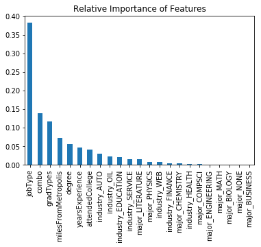

# Salary Predictions Based on Job Descriptions

# Step 4: Deploy


```python
import pandas as pd
from sklearn.pipeline import Pipeline
from sklearn.ensemble import RandomForestRegressor

%matplotlib inline
```


```python
import sys
sys.path.insert(0, './scripts')

from helpers import load_data
from Preprocessing import Preprocessing
```

## Automating the Pipeline

I need to load in the cleaned training data and the testing data. I'll then set up the Pipeline object to automatically preprocess the data and train the model on the preprocessed data.


```python
path = './cleaned_data/'
files = ['cleaned.csv']
train_data = pd.DataFrame()

for file in files:
    train_data = train_data.append(load_data(path, file))

print(train_data.shape)
train_data.head()
```

    (991513, 8)


<div>
<style scoped>
    .dataframe tbody tr th:only-of-type {
        vertical-align: middle;
    }

    .dataframe tbody tr th {
        vertical-align: top;
    }

    .dataframe thead th {
        text-align: right;
    }
</style>
<table border="1" class="dataframe">
  <thead>
    <tr style="text-align: right;">
      <th></th>
      <th>salary</th>
      <th>companyId</th>
      <th>jobType</th>
      <th>degree</th>
      <th>major</th>
      <th>industry</th>
      <th>yearsExperience</th>
      <th>milesFromMetropolis</th>
    </tr>
    <tr>
      <th>jobId</th>
      <th></th>
      <th></th>
      <th></th>
      <th></th>
      <th></th>
      <th></th>
      <th></th>
      <th></th>
    </tr>
  </thead>
  <tbody>
    <tr>
      <th>JOB1362684407687</th>
      <td>130</td>
      <td>COMP37</td>
      <td>CFO</td>
      <td>MASTERS</td>
      <td>MATH</td>
      <td>HEALTH</td>
      <td>10</td>
      <td>83</td>
    </tr>
    <tr>
      <th>JOB1362684407688</th>
      <td>101</td>
      <td>COMP19</td>
      <td>CEO</td>
      <td>HIGH_SCHOOL</td>
      <td>NONE</td>
      <td>WEB</td>
      <td>3</td>
      <td>73</td>
    </tr>
    <tr>
      <th>JOB1362684407689</th>
      <td>137</td>
      <td>COMP52</td>
      <td>VICE_PRESIDENT</td>
      <td>DOCTORAL</td>
      <td>PHYSICS</td>
      <td>HEALTH</td>
      <td>10</td>
      <td>38</td>
    </tr>
    <tr>
      <th>JOB1362684407690</th>
      <td>142</td>
      <td>COMP38</td>
      <td>MANAGER</td>
      <td>DOCTORAL</td>
      <td>CHEMISTRY</td>
      <td>AUTO</td>
      <td>8</td>
      <td>17</td>
    </tr>
    <tr>
      <th>JOB1362684407691</th>
      <td>163</td>
      <td>COMP7</td>
      <td>VICE_PRESIDENT</td>
      <td>BACHELORS</td>
      <td>PHYSICS</td>
      <td>FINANCE</td>
      <td>8</td>
      <td>16</td>
    </tr>
  </tbody>
</table>
</div>


```python
path = './raw_data/'
file = 'test_features.csv'
features_test = load_data(path, file)
```


```python
target = ['salary']
features = [col for col in train_data.columns if col not in target]

features_train = train_data[features]
salary_train = train_data[target]
```


```python
cols_to_filter = ['companyId']
ordinal_cols = {'jobType': ['JANITOR', 'JUNIOR', 'SENIOR', 'MANAGER', 'VICE_PRESIDENT', 'CFO', 'CTO', 'CEO'],
                'degree': ['NONE', 'HIGH_SCHOOL', 'BACHELORS', 'MASTERS', 'DOCTORAL']
               }
binned_cols = {'yearsExperience': 5}
p = Preprocessing(cols_to_filter=cols_to_filter, ordinal_cols=ordinal_cols,
                  binned_cols=binned_cols, grad_types=True,
                  combo=True                          
                 )
rf = RandomForestRegressor(max_depth=25, min_samples_leaf=17, max_features=.35,
                           n_estimators=100, n_jobs=-1, random_state=44        
                          )

pipeline = Pipeline([('preprocessing', p), ('Random Forest', rf)])
```

## Deploying the solution


```python
# Fitting the pipeline
pipeline.fit(features_train, salary_train.values.ravel())
salary_pred = pipeline.predict(features_test)
```


```bash
%%bash
rm -r ./final_output
mkdir ./final_output
```


```python
# Saving predicted salaries to an external csv
salary_pred = pd.Series(salary_pred, index=features_test.index)
salary_pred.to_csv('./final_output/test_salaries.csv', header=True)
```

Outputting the trained model using joblib allows me to not need to train the model in every application that I'd like to use it for. I'll be saving it along with the predictions csv in a folder labeled 'final_output'


```python
# Saving the trained model for further use if necessary for others
import joblib
joblib.dump(pipeline, './final_output/final_model.joblib')
```


    ['./final_output/final_model.joblib']


## Measuring Efficacy 
I cannot perform this last step because I do not have the solutions to the testing data.

## Final Summary


```python
columns = pipeline.steps[0][1].transform(features_train.iloc[0:1,:]).columns
importances = pipeline.steps[1][1].feature_importances_

importance = pd.Series(importances, index=columns).sort_values(ascending=False)
ax = importance.plot.bar()
ax.set_title('Relative Importance of Features')
```


    Text(0.5, 1.0, 'Relative Importance of Features')





By far, the most important feature in the building of the Random Forest model was the *jobType* feature. I still think that there is some untapped potential in the *major* and *industry* features.

## What I'd Change in the Future

The biggest change that needs to happen on my next project is more efficient and productive EDA and Feature Engineering. To achieve this, I'll spend more time investigating the business problem and gaining domain knowledge that could help me set a plan for data investigation. I want to go into EDA with a plan that is then altered instead of meandering all possibilities to find patterns that may or may not exist within the data itself. I'll also be researching the finer points of Feature Engineering to possibly enhance my approach to creating new features. I believe I had a good intuition for transforming the categorical columns the way I did, but I don't believe I did as good a job as I could to create new information.

One thing that I neglected in my analysis was the Multicollinearity of features after Preprocessing. For an example, a dummied major can be represented completely by the rest of the majors being absent. This kind of multicollinearity can cause problems of instability for models as well as creating bias in other models such as KNN. If one feature correlates highly with another feature, it can produce an overweighting of the model in the correlation direction. This is the same reason why double counting is ideally avoided when sampling for a survey. 

On the software engineering side of things, I would implement proper unit testing for my Preprocessing object and various helper functions. I might be able to refactor some of the steps in my fit and transform methods so that my code is less procedural and more modular. As of 6/13/19, I have not added these changes to my code, but I might at a future date and will update all projects and scripts appropriately. 
